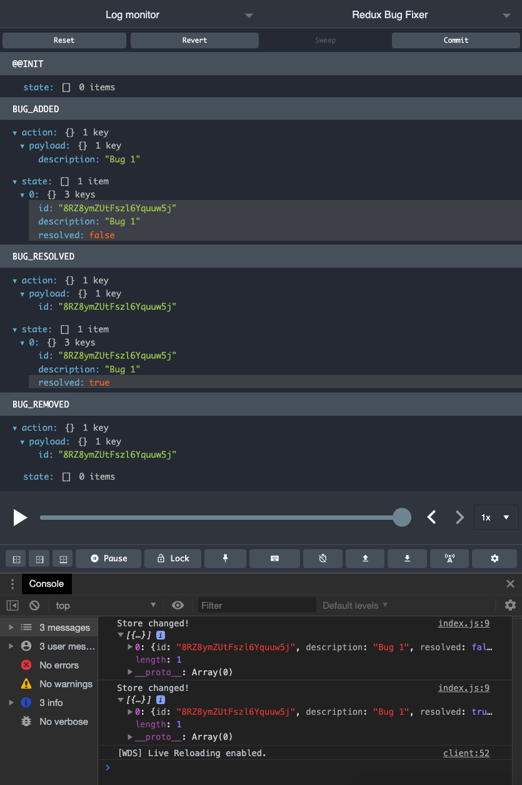

# Redux Bug Fixer

**Author** Peter Cole  
**Version** 1.0.4

## Overview

- A bug fixing application using React, Redux and a Node.js backend
- Material sourced from the [The Ultimate Redux Course](https://codewithmosh.com/p/ultimate-redux) by Mosh Hamedani

## Dev Info

```javascript
"scripts": {
	"start": "webpack-dev-server --config ./webpack.config.js",
	"test": "jest"
},
"devDependencies": {
	"jest": "^26.6.0",
	"webpack": "4.41.6",
	"webpack-cli": "3.3.11",
	"webpack-dev-server": "3.10.3"
},
"dependencies": {
	"immer": "^7.0.9",
	"nanoid": "^3.1.13",
	"redux": "^4.0.5",
	"redux-devtools-extension": "^2.13.8"
}
```

## Snapshot



<!--
Step 1 - Design the Store
const store = {
	bugs: [{ id: 1, description: '', resolved: false }],
	currentUser: { name: 'Peter' },
};

Step 2 - Create Actions
const action = {
	type: 'BUG_ADDED',
	payload: {
		description: '...',
	},
};

Step 3 - Create Reducers
   see ./reducer.js

Step 4 - Set Up the Store
   see ./store.js
-->
